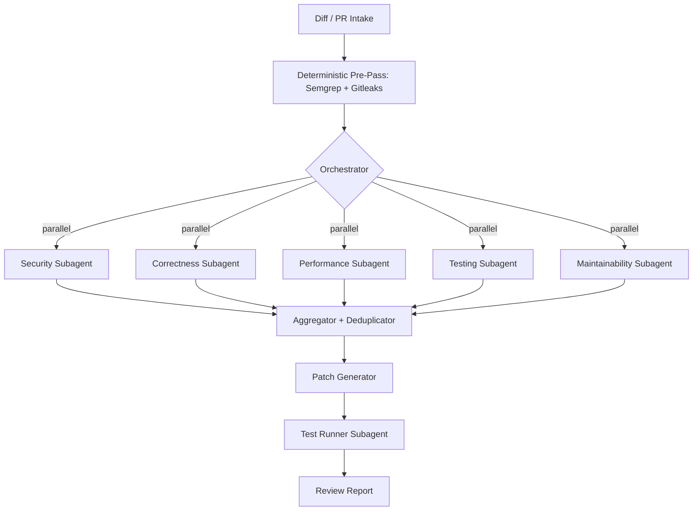

# ReviewGuard — Technical Requirements Document
> Five subagents, one context-clean orchestrator, zero token waste — a diff goes in, a verified patch set comes out.

**Built for:** IBM Bob Hackathon — Track 3, AI Code Review and Security Assistant
**Doc status:** v1.0 — Draft for hackathon submission

This document specifies how ReviewGuard is implemented as an IBM Bob **workflow**: a mix of deterministic steps (diff parsing, deduplication, test execution) and AI-driven steps (the five review subagents, patch generation), following Bob's documented pattern of keeping agentic reasoning for the steps that need judgment and deterministic code for everything that doesn't. Interpreted design choices (queue technology, specific model routing) are marked as such; they are implementation recommendations, not fixed requirements.

## Tokens — Tech Stack

| Layer | Choice | Rationale |
|---|---|---|
| Orchestration | IBM Bob Workflow (Agent mode, root orchestrator) | Native subagent spawning, parallel tool calling, per-step rollback |
| Subagent runtime | Bob subagents — `explore` type for read-only analysis passes, `general` type for patch/test steps | Matches Bob's built-in subagent taxonomy; explore agents run on a lighter model for cheap parallel fan-out |
| Diff parsing | `unidiff` / `gitpython` (Python) | Mature, well-tested diff-to-structured-hunks parsing |
| Security rule assist | Semgrep (OSS ruleset) as a deterministic pre-pass feeding the Security subagent | Deterministic, false-positive-cheap patterns (hardcoded keys, SQLi sinks) don't need an LLM to *find*, only to *explain and rank* |
| Secret scanning | Gitleaks-style regex/entropy pre-pass | Catches API keys/tokens before the LLM pass, cheaply and deterministically |
| Backend API | FastAPI (Python) | Async-friendly, pairs naturally with parallel subagent calls |
| Datastore | PostgreSQL | Relational integrity between reviews, findings, and patches (see Backend Schema doc) |
| Report/patch storage | Object storage (local disk for hackathon demo; S3-compatible for production) | Reports and generated diffs are immutable artifacts, not query targets |
| Frontend | React + Tailwind, dark theme with severity-coded accents | Matches the "findings dashboard" UI flow |
| CI integration | GitHub Actions / GitLab CI webhook trigger | Fires ReviewGuard on `pull_request` events without changing the team's existing pipeline |
| Test execution | Sandboxed subprocess runner (pytest / jest, language-detected) | Verifies generated patches don't regress the suite before reporting "fixed" |

## Tokens — Multi-Agent Architecture

| Subagent | Type | Scope | Reads | Returns |
|---|---|---|---|---|
| Security Reviewer | `explore` | Hardcoded secrets, injection (SQL/command/XSS), insecure deserialization, missing authZ/authN, unsafe crypto | Diff + Semgrep/Gitleaks pre-pass output | Structured findings: `{file, line, cwe_id, severity, explanation}` |
| Correctness Reviewer | `explore` | Logic errors, off-by-one, null/undefined handling, unhandled exceptions | Diff + surrounding function context | Structured findings with reproduction reasoning |
| Performance Reviewer | `explore` | Nested loops on large collections, N+1 query patterns, redundant computation | Diff + call-site context (via read-only repo grep) | Findings with complexity estimate (e.g. "O(n²) — becomes O(n) with a set lookup") |
| Testing Reviewer | `explore` | Public/critical functions with no covering test, untested branches | Diff + existing test file structure | Findings + draft test skeletons |
| Maintainability Reviewer | `explore` | Duplicate code, naming, function size, mixed responsibilities | Diff + repo-wide grep for near-duplicate blocks | Findings with a refactor suggestion |
| Patch Generator | `general` | Writes concrete fixes for findings above Medium severity | Finding + surrounding file content (write access) | Unified diff patch per finding |
| Test Runner | `general` | Applies patches in a sandbox, runs test suite, reports pass/fail | Patched files + existing test command | Pass/fail + failure detail if regressed |

All five review subagents are dispatched **in parallel** in a single orchestrator turn (Bob's native parallel tool calling), each in its own isolated context — none sees the other four's output, which keeps findings independent and avoids one subagent's framing biasing another's. The orchestrator only pays the token cost of each subagent's *summary*, not its intermediate exploration, matching Bob's context-isolation design for subagents.



## Tokens — Non-Functional Requirements

| Requirement | Target | Notes |
|---|---|---|
| Latency (150 LOC diff) | ≤ 5 min end-to-end | Dominated by subagent fan-out + test run, not the orchestrator |
| Parallelism | 5 subagents concurrent | Relies on Bob's parallel native tool calling |
| Token efficiency | Orchestrator context stays under ~20% of window per review | Achieved by only ingesting subagent *summaries*, never raw exploration traces |
| Idempotency | Re-running on an unchanged diff produces the same findings | Deterministic pre-passes are cached by diff hash |
| Rollback safety | Any patch applied by the Patch Generator must be revertible | Use Bob's per-tool-call rollback tracking; never require git for a demo revert |
| Language support (hackathon scope) | Python, JavaScript/TypeScript | Extendable via language-specific lint/test adapters |
| False-positive tolerance | Low-severity findings biased toward comment-only, not merge-blocking | Keeps trust high — see PRD Non-Goals |

## Components — Core Services

### Diff Ingestion Service
**Role:** Accepts a raw diff, a PR URL (via GitHub/GitLab API), or a local branch comparison; normalizes into per-file hunks with surrounding context lines, and computes a diff hash for caching/idempotency.

### Orchestrator (Bob Workflow)
**Role:** Deterministic workflow steps (intake, pre-pass, aggregation, report render) interleaved with AI-driven steps (the five subagent dispatches, patch generation) — following Bob's workflow pattern of using zero-token deterministic steps wherever the logic doesn't require reasoning.

### Aggregator & Deduplicator
**Role:** Deterministic step. Groups findings by `(file, line-range overlap, category)`, collapses near-duplicates, and resolves severity conflicts by taking the maximum reported severity while retaining both subagents' explanations for auditability.

### Patch Generator
**Role:** `general`-type subagent with file write access, scoped to a single finding at a time so a bad patch can't cascade — generates a minimal unified diff, never a full-file rewrite, to keep review of the *fix* itself fast.

### Test Runner
**Role:** Applies each accepted patch in an isolated sandbox/worktree, runs the project's existing test command plus any newly generated tests, and reports pass/fail back to the orchestrator before the patch is marked "verified" in the final report.

### Report Renderer
**Role:** Deterministic template step — assembles the aggregated, patched, and tested findings into the final Markdown/HTML report and posts it as a PR comment via the GitHub/GitLab API.

## API Surface (indicative)

| Endpoint | Method | Purpose |
|---|---|---|
| `/v1/reviews` | `POST` | Start a review (accepts diff content or PR URL) |
| `/v1/reviews/{id}` | `GET` | Poll review status / fetch final report |
| `/v1/reviews/{id}/findings` | `GET` | List findings, filterable by severity/category |
| `/v1/reviews/{id}/findings/{finding_id}/patch` | `GET` | Fetch the suggested patch for one finding |
| `/v1/reviews/{id}/findings/{finding_id}/apply` | `POST` | Apply a patch and trigger the Test Runner |
| `/v1/webhooks/github` | `POST` | Inbound PR-event webhook that triggers a review automatically |
| `/v1/config/rules` | `GET/PUT` | Per-repo severity thresholds and category enable/disable |

## Security & Compliance Considerations

- ReviewGuard never writes a discovered secret into logs, the database, or the rendered report in plaintext — findings reference the secret's *location and pattern type* only (e.g. "AWS-style key literal at line 42"), never the literal value.
- The Patch Generator subagent runs with write access scoped to a sandboxed worktree, never the developer's working directory directly, so a bad patch can't corrupt local state.
- Webhook payloads are verified against the GitHub/GitLab signing secret before a review is triggered, to prevent spoofed review requests.
- All subagent-to-orchestrator communication stays within the single Bob workflow run — no finding data leaves the workflow boundary except the final report and, optionally, the PR comment.

## Similar Prior Art (tools ReviewGuard composes, not competes with)

- **Semgrep** — deterministic pattern matching feeds the Security subagent's pre-pass so the LLM reasons about *ranking and explaining*, not raw pattern discovery.
- **Gitleaks** — entropy/regex secret detection runs ahead of the Security subagent for the same reason.
- **pytest / jest** — existing test runners are wrapped, not replaced, by the Test Runner subagent.

## Quick Start (Workflow Config, indicative)

```yaml
workflow: reviewguard
trigger: pull_request
steps:
  - id: intake
    type: deterministic
    action: parse_diff
  - id: pre_pass
    type: deterministic
    action: [semgrep_scan, gitleaks_scan]
  - id: review
    type: ai_parallel
    subagents:
      - security
      - correctness
      - performance
      - testing
      - maintainability
  - id: aggregate
    type: deterministic
    action: dedupe_and_rank
  - id: patch
    type: ai
    subagent: patch_generator
    condition: severity >= medium
  - id: verify
    type: ai
    subagent: test_runner
  - id: report
    type: deterministic
    action: render_and_post
```
