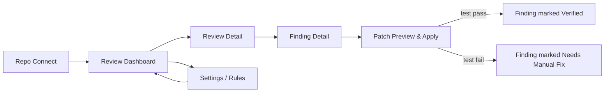

# ReviewGuard — UI Flow
> Every screen answers one question: what's broken, how bad is it, and what do I click to fix it.

**Built for:** IBM Bob Hackathon — Track 3, AI Code Review and Security Assistant
**Doc status:** v1.0 — Draft for hackathon submission

Screen names and exact copy below are suggested, not final — the wireframe descriptions are enough to build a working demo UI; visual polish (spacing, exact typography scale) is left to implementation.

## Tokens — Screens

| Screen | Purpose | Entry Point |
|---|---|---|
| Repo Connect | Link a GitHub/GitLab repo or paste a raw diff | First-run / "New Review" button |
| Review Dashboard | List of all reviews run for a repo, sortable by severity/date | Default landing screen after connecting a repo |
| Review Detail | One PR's full findings, grouped by severity | Click a row in Review Dashboard |
| Finding Detail | Single finding: explanation, diff context, suggested patch, apply/dismiss | Click a finding in Review Detail |
| Patch Preview & Apply | Side-by-side before/after of a suggested patch, with test-run status | "View patch" from Finding Detail |
| Settings / Rules | Per-repo severity thresholds, category on/off, ignored paths | Gear icon, persistent nav |

## Tokens — Severity Color Coding

| Severity | Color Role | Usage |
|---|---|---|
| Critical | Red accent | Badge, left border on finding card, blocks the "Merge" indicator |
| High | Orange accent | Badge, left border |
| Medium | Yellow/amber accent | Badge, left border |
| Low | Blue accent | Badge, left border |
| Info | Neutral gray | Badge only, no border emphasis |

Dark canvas base (near-black), severity color is the *only* place saturated color appears — findings lists should read like a triage board, not a rainbow.

## App Navigation Flow

## Screen-by-Screen Detail

### 1. Repo Connect
**Purpose:** Get a diff into the system with the least friction possible — this is the only screen a brand-new user sees before their first result.

- Two entry modes, tabbed: "Connect Repository" (OAuth to GitHub/GitLab, then pick a PR from a dropdown) and "Paste a Diff" (raw textarea, for the offline/demo path).
- A single primary action: **Run Review**.
- While a review runs, the screen transitions to a lightweight progress state showing each subagent's status (`Security ✓ · Correctness ✓ · Performance running… · Testing queued · Maintainability queued`) rather than a generic spinner — this is the moment that sells the "five reviewers in parallel" story.

### 2. Review Dashboard
**Purpose:** At-a-glance history of every review run, so a team can see whether code health is trending better or worse.

- Table/list of past reviews: PR title, repo, date, severity summary as compact colored dots (`● 1 Critical  ● 2 High  ● 3 Medium`), overall status (Blocked / Passed / Needs Attention).
- Sort/filter by severity, date, repo.
- Primary action per row: click through to Review Detail.
- Empty state (no reviews yet): short explanation + "Run your first review" CTA back to Repo Connect.

### 3. Review Detail
**Purpose:** The core report — everything a reviewer needs to decide merge/block in one screen.

- Header: PR title, source/target branch, diff stat (+142/−18), overall verdict badge (Blocked / Passed).
- Executive summary paragraph (plain-language, 2–3 sentences): what was found, what's blocking.
- Findings list, grouped by severity (Critical section first), each finding shown as a compact card: category icon, one-line description, file:line, "Has patch" indicator.
- Tab or filter bar: All / Security / Correctness / Performance / Testing / Maintainability.
- Secondary action: "Export report" (Markdown/PDF) and "Post to PR" (if not already posted).

### 4. Finding Detail
**Purpose:** Full context on one finding — this is where trust is won or lost, so the explanation has to be specific, not generic.

- Finding header: severity badge, category, CWE/reference tag where applicable (e.g. "CWE-89 — SQL Injection").
- Code context panel: the diff hunk with the flagged line(s) highlighted.
- Explanation panel: why this is a problem, in plain language, referencing the actual variable/function names from the diff — never a templated generic warning.
- Confidence indicator (subagent's self-reported confidence, surfaced so users learn to calibrate trust).
- Actions: **View Suggested Patch**, **Dismiss** (with a required one-line reason, logged for the team), **Mark as False Positive** (feeds back into future runs' tuning).

### 5. Patch Preview & Apply
**Purpose:** Make applying a fix as low-risk and low-effort as reviewing it.

- Side-by-side (or unified) diff: current code vs. patched code.
- Test status strip: "Running existing test suite + 1 new test…" → resolves to `✓ 12 passed` or `✗ 2 failed` with failure detail expandable.
- Primary action: **Apply Patch** (writes the patch, re-runs tests, updates Finding status to Verified).
- Secondary action: **Copy patch** (for manual application) and **Edit before applying** (opens an inline editable diff).

### 6. Settings / Rules
**Purpose:** Let a team tune ReviewGuard to their own risk tolerance without touching code.

- Per-category toggle (Security / Correctness / Performance / Testing / Maintainability) — on by default.
- Severity threshold slider for "blocks merge" (default: High and above).
- Ignored paths list (e.g. `vendor/`, `*.generated.ts`).
- Webhook status (connected repo, last event received).

## Interaction States (apply across screens)

| State | Treatment |
|---|---|
| Loading (review running) | Per-subagent status list, not a blank spinner — reinforces the parallel-agent story |
| Empty (no findings) | Green "Passed" state with a short congratulatory summary, not just an empty list |
| Error (diff unparseable / webhook failure) | Specific, actionable message ("Couldn't parse diff — check it's a valid unified diff") never a bare stack trace |
| Patch apply failure (test regression) | Finding stays Medium/High severity, status changes to "Needs Manual Fix", failing test output shown inline |
