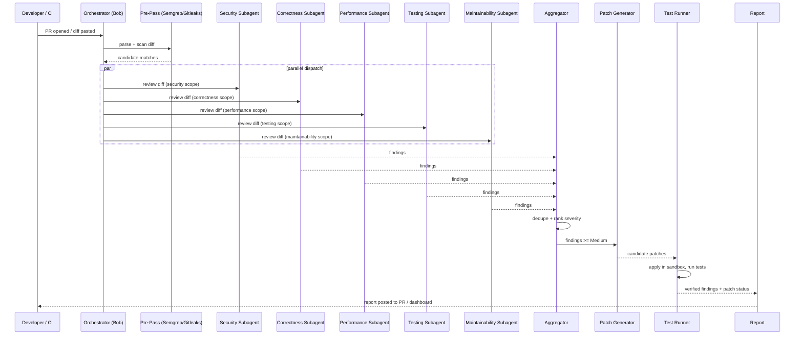

# ReviewGuard — Application Flow
> From `git diff` to a verified, tested patch — one pipeline, five parallel minds, no human idle time in between.

**Built for:** IBM Bob Hackathon — Track 3, AI Code Review and Security Assistant
**Doc status:** v1.0 — Draft for hackathon submission

This document traces one review end-to-end, step by step, with the actor, input, output, and underlying Bob mechanism for each stage. It maps directly onto the TRD's workflow config and the demo script in the PRD.

## Tokens — End-to-End Sequence

| Step | Actor | Input | Output | Bob Mechanism |
|---|---|---|---|---|
| 1. Trigger | GitHub/GitLab webhook, or manual "Paste diff" | PR opened/updated event, or raw diff paste | Raw diff payload | Deterministic workflow trigger |
| 2. Intake & Parse | Diff Ingestion Service | Raw diff | Structured per-file hunks + context | Deterministic step |
| 3. Deterministic Pre-Pass | Semgrep + Gitleaks | Structured hunks | Candidate security matches (unranked) | Deterministic step, zero AI tokens |
| 4. Parallel Subagent Dispatch | Orchestrator (Bob Agent mode) | Hunks + pre-pass candidates | 5 concurrent subagent runs spawned | Native parallel tool calling |
| 5a–5e. Specialized Review | Security / Correctness / Performance / Testing / Maintainability subagents | Diff + relevant context (each agent's own read-only exploration) | Structured findings per agent, isolated context | `explore`-type subagents, no shared state |
| 6. Aggregation | Aggregator (deterministic) | 5 findings sets | Deduplicated, severity-ranked finding list | Deterministic step |
| 7. Patch Generation | Patch Generator subagent | Findings ≥ Medium severity | Unified diff patch per finding | `general`-type subagent, scoped write access |
| 8. Sandbox Apply + Test | Test Runner subagent | Patch + existing test suite | Pass/fail per patch, new test skeletons for gaps | `general`-type subagent, sandboxed worktree |
| 9. Report Rendering | Report Renderer (deterministic) | Verified findings + patches + test results | Markdown/HTML report | Deterministic template step |
| 10. Delivery | Orchestrator | Rendered report | Posted PR comment + dashboard entry | GitHub/GitLab API call |

## Detailed Flow Narrative

**Trigger.** A review starts one of two ways: automatically, when a `pull_request` webhook fires on `opened` or `synchronize`, or manually, when a developer pastes a raw diff into the Repo Connect screen for an offline/local review. Both paths converge on the same intake payload shape, so the rest of the pipeline never needs to know which trigger fired it.

**Intake & deterministic pre-pass.** The diff is parsed into per-file hunks with enough surrounding context (typically ±15 lines) for a subagent to reason about the change without re-reading the whole file. Before any AI call happens, Semgrep and Gitleaks run over the new/changed lines — this is deliberate: pattern-matchable security signals (a `sk_live_` prefix, a raw SQL string concatenation) don't need a language model to *find*, so finding them deterministically saves both latency and token spend, and gives the Security subagent a head start rather than a blank page.

**Parallel subagent dispatch.** The orchestrator spawns all five review subagents in a single turn using Bob's native parallel tool calling. Each subagent is an `explore`-type run: read-only, isolated context, no visibility into the other four agents' reasoning. This isolation is a feature, not a limitation — it's what prevents one subagent's framing ("this looks like a performance issue") from suppressing another's independent read of the same code ("this is actually also a security issue"). Each subagent returns a compact, structured summary; none of its intermediate exploration (file reads, grep results) pollutes the orchestrator's context.

**Aggregation.** A deterministic step — not an LLM call — groups findings that reference overlapping line ranges in the same file and collapses them into one entry when they describe the same underlying defect, while keeping both subagents' framing if they genuinely disagree (e.g. Correctness flags a missing null check that Security also flags as a potential crash-based DoS — both perspectives are preserved in one finding's detail view). Severity conflicts resolve to the higher of the two.

**Patch generation and verification.** Only findings at Medium severity or above get a generated patch, to keep noise down — Low/Info findings are reported but not auto-patched. The Patch Generator is a `general`-type subagent with write access scoped to a sandboxed worktree copy of the repo, never the developer's actual working directory. Once a patch is written, the Test Runner subagent applies it in that same sandbox and runs the project's existing test command, plus any new test skeletons the Testing subagent drafted for previously-uncovered functions. A patch is only marked **Verified** in the final report if the full suite passes after it's applied — this is the step that turns "here's a suggestion" into "here's a fix that's already been checked."

**Report and delivery.** The final report is assembled by a deterministic template step (no AI call needed once the data is structured) and delivered two ways: posted as a comment on the originating PR (if triggered via webhook), and written to the Review Dashboard for historical tracking. The report format is identical regardless of trigger source, so a locally-pasted diff and a live PR produce the same artifact.

## Demo Flow (Seeded Sample PR)

The demo PR is constructed to exercise all five subagents with one finding each, so the parallel-review story is visible end-to-end in a single run:

| # | Seeded Issue | Subagent That Catches It | Expected Severity |
|---|---|---|---|
| 1 | Hardcoded API key in a config file | Security | Critical |
| 2 | String-concatenated SQL query built from request input | Security | Critical |
| 3 | Missing input validation on a public endpoint parameter | Correctness / Security (dual-flagged, deduped) | High |
| 4 | Bare `except:` swallowing an exception in a payment path | Correctness | High |
| 5 | No test covering a critical calculation function | Testing | Medium |
| 6 | Nested loop doing an O(n²) lookup over a large list | Performance | Low–Medium |

Running this PR through ReviewGuard produces the manual-vs-assisted comparison used in the PRD's Quick Start: a 30-minute unstructured manual pass versus a ~5-minute structured, patched, and test-verified ReviewGuard pass.

## Error & Fallback Flows

| Failure Point | Fallback Behavior |
|---|---|
| One subagent times out or errors | Orchestrator proceeds with the remaining 4 agents' findings; report notes the incomplete category rather than failing the whole review |
| Patch fails to apply cleanly (merge conflict in sandbox) | Finding is reported without a patch, flagged "Manual fix required" |
| Generated patch fails tests | Finding stays open at its original severity, failing test output attached, patch shown as "Suggested (unverified)" rather than silently discarded |
| Webhook signature invalid | Request rejected, no review triggered, logged as a security event |
| Diff unparseable | User sees a specific parse error on the Repo Connect screen; no partial review is attempted |
