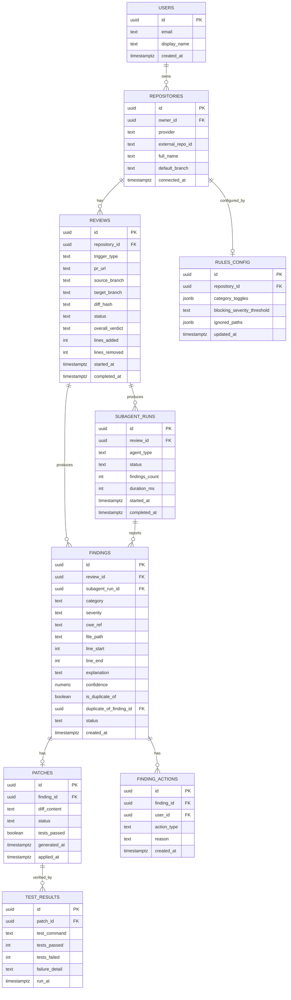

# ReviewGuard — Backend Schema
> One review, five agent runs, N findings, M patches — normalized enough to query, simple enough to build in a weekend.

**Built for:** IBM Bob Hackathon — Track 3, AI Code Review and Security Assistant
**Doc status:** v1.0 — Draft for hackathon submission

Schema below targets PostgreSQL. Column types and constraints are implementation-level recommendations sized for the hackathon demo scope (single-team, moderate review volume), not a production capacity plan.

## Entity Relationship Diagram

## Table Definitions

### `repositories`
| Column | Type | Constraints | Notes |
|---|---|---|---|
| `id` | `uuid` | PK, default `gen_random_uuid()` | |
| `owner_id` | `uuid` | FK → `users.id`, not null | |
| `provider` | `text` | not null, check in (`github`,`gitlab`,`local`) | |
| `external_repo_id` | `text` | nullable | Null for locally-pasted-diff-only usage |
| `full_name` | `text` | not null | e.g. `org/repo` |
| `default_branch` | `text` | not null, default `main` | |
| `connected_at` | `timestamptz` | not null, default `now()` | |

### `reviews`
| Column | Type | Constraints | Notes |
|---|---|---|---|
| `id` | `uuid` | PK | |
| `repository_id` | `uuid` | FK → `repositories.id`, not null | |
| `trigger_type` | `text` | check in (`webhook`,`manual_diff`,`cli`) | |
| `pr_url` | `text` | nullable | |
| `source_branch` / `target_branch` | `text` | nullable | Null for raw-diff-paste reviews |
| `diff_hash` | `text` | not null, indexed | Enables idempotent re-run detection |
| `status` | `text` | check in (`pending`,`running`,`completed`,`failed`) | |
| `overall_verdict` | `text` | check in (`passed`,`blocked`,`needs_attention`) | Nullable until `completed` |
| `lines_added` / `lines_removed` | `int` | | |
| `started_at` / `completed_at` | `timestamptz` | | |

**Index:** `(repository_id, diff_hash)` unique — a re-run on the same unchanged diff reuses the cached result instead of re-dispatching subagents.

### `subagent_runs`
| Column | Type | Constraints | Notes |
|---|---|---|---|
| `id` | `uuid` | PK | |
| `review_id` | `uuid` | FK → `reviews.id`, not null | |
| `agent_type` | `text` | check in (`security`,`correctness`,`performance`,`testing`,`maintainability`,`patch_generator`,`test_runner`) | |
| `status` | `text` | check in (`queued`,`running`,`completed`,`timed_out`,`error`) | |
| `findings_count` | `int` | default 0 | |
| `duration_ms` | `int` | | Used for the "5 subagents complete in 38s" demo telemetry |
| `started_at` / `completed_at` | `timestamptz` | | |

### `findings`
| Column | Type | Constraints | Notes |
|---|---|---|---|
| `id` | `uuid` | PK | |
| `review_id` | `uuid` | FK → `reviews.id`, not null | |
| `subagent_run_id` | `uuid` | FK → `subagent_runs.id`, not null | Which agent originally raised it |
| `category` | `text` | check in (`security`,`correctness`,`performance`,`testing`,`maintainability`) | |
| `severity` | `text` | check in (`critical`,`high`,`medium`,`low`,`info`) | |
| `cwe_ref` | `text` | nullable | e.g. `CWE-89` |
| `file_path` | `text` | not null | |
| `line_start` / `line_end` | `int` | not null | |
| `explanation` | `text` | not null | |
| `confidence` | `numeric(3,2)` | check 0–1 | Subagent's self-reported confidence |
| `is_duplicate_of` | `boolean` | default false | |
| `duplicate_of_finding_id` | `uuid` | FK → `findings.id`, nullable | Set when the Aggregator collapses two agents' findings into one |
| `status` | `text` | check in (`open`,`patched`,`verified`,`dismissed`,`false_positive`) | |
| `created_at` | `timestamptz` | default `now()` | |

**Index:** `(review_id, severity)` — powers the severity-grouped Review Detail screen.

### `patches`
| Column | Type | Constraints | Notes |
|---|---|---|---|
| `id` | `uuid` | PK | |
| `finding_id` | `uuid` | FK → `findings.id`, unique, not null | One patch per finding |
| `diff_content` | `text` | not null | Unified diff format |
| `status` | `text` | check in (`suggested`,`applied`,`verified`,`failed`) | |
| `tests_passed` | `boolean` | nullable | Null until Test Runner completes |
| `generated_at` / `applied_at` | `timestamptz` | | |

### `test_results`
| Column | Type | Constraints | Notes |
|---|---|---|---|
| `id` | `uuid` | PK | |
| `patch_id` | `uuid` | FK → `patches.id`, not null | |
| `test_command` | `text` | not null | e.g. `pytest -q` |
| `tests_passed` / `tests_failed` | `int` | | |
| `failure_detail` | `text` | nullable | Raw failure output, truncated |
| `run_at` | `timestamptz` | default `now()` | |

### `rules_config`
| Column | Type | Constraints | Notes |
|---|---|---|---|
| `id` | `uuid` | PK | |
| `repository_id` | `uuid` | FK → `repositories.id`, unique, not null | |
| `category_toggles` | `jsonb` | default `{"security":true,"correctness":true,"performance":true,"testing":true,"maintainability":true}` | |
| `blocking_severity_threshold` | `text` | default `high` | |
| `ignored_paths` | `jsonb` | default `[]` | Array of glob strings |
| `updated_at` | `timestamptz` | | |

### `users`
| Column | Type | Constraints | Notes |
|---|---|---|---|
| `id` | `uuid` | PK | |
| `email` | `text` | unique, not null | |
| `display_name` | `text` | | |
| `created_at` | `timestamptz` | default `now()` | |

### `finding_actions`
| Column | Type | Constraints | Notes |
|---|---|---|---|
| `id` | `uuid` | PK | |
| `finding_id` | `uuid` | FK → `findings.id`, not null | |
| `user_id` | `uuid` | FK → `users.id`, not null | |
| `action_type` | `text` | check in (`dismiss`,`mark_false_positive`,`apply_patch`,`comment`) | |
| `reason` | `text` | nullable | Required at the app layer for `dismiss` |
| `created_at` | `timestamptz` | default `now()` | |

## Notes on Indexing & Performance

- `reviews(repository_id, diff_hash)` unique index is the idempotency backbone — it's what makes a re-triggered webhook on the same commit a cache hit instead of a duplicate 5-agent run.
- `findings(review_id, severity)` is the hot-path index for the Review Detail screen's severity-grouped view.
- `subagent_runs(review_id)` supports the "per-agent status" progress UI during an in-flight review — the frontend polls this table, not the findings table, while a review is `running`.
- `patches` and `test_results` are kept as separate tables (rather than columns on `findings`) so a finding can be re-patched without losing the history of a prior failed attempt.
